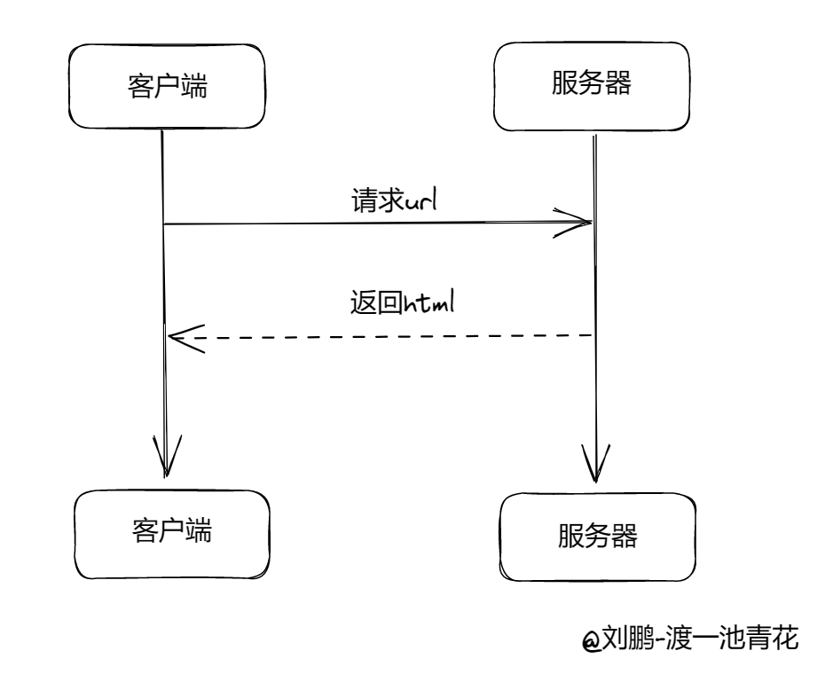
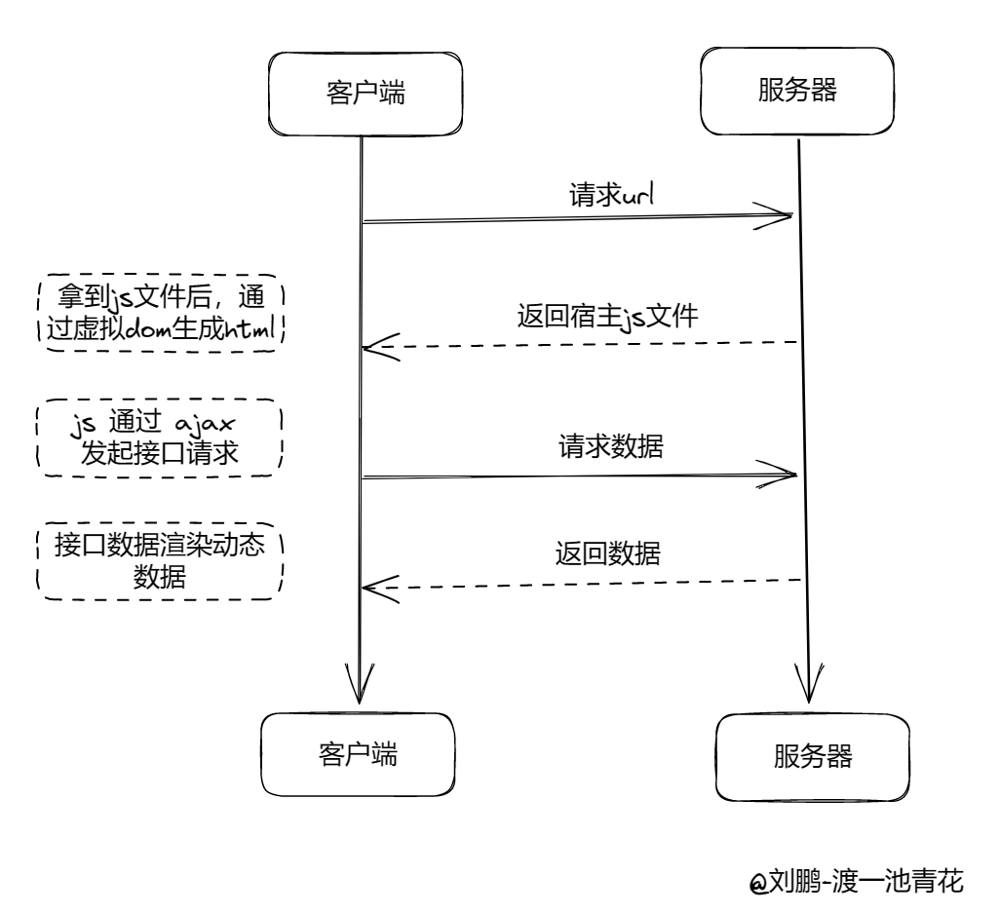
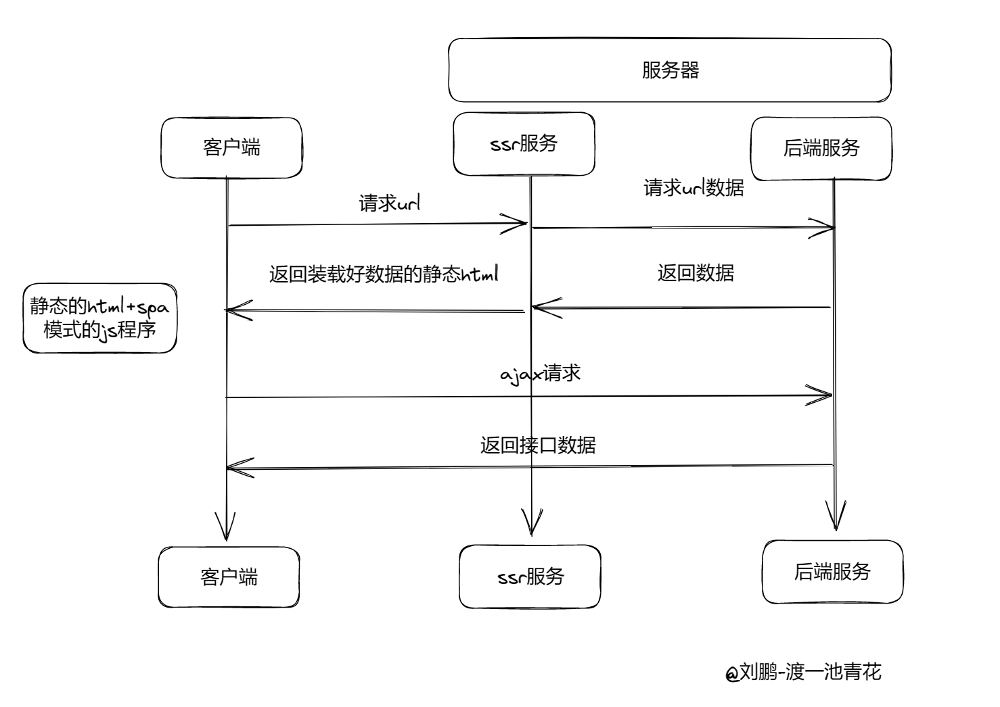

## 一、什么是 ssh

`Server-Side Rendering` 我们称其为 `SSR`，意为服务器渲染。

指由服务侧完成页面的 `HTML` 结构拼接的页面处理技术，发送到浏览器，然后为其绑定状态与事件，成为完全可交互页面的过程。

`Web` 3个阶段的发展史；

* 传统服务器渲染 SSR
* 单页面应用 SPA
* 服务渲染 SSR

### 传统 web 开发

网页内容在服务端渲染完成，⼀次性传输到浏览器

通过浏览器的开发者工具就能获取整体的 html。

### 单页面应用SPA

单页应用优秀的用户体验，使其逐渐成为主流，页面内容由JS渲染出来，这种方式称为客户端渲染。

这种方式通过浏览器的开发者工具查看到的是加密混淆后的js文件，不利于js逆向工程破解。

### 服务端渲染SSR

`SSR`解决方案，后端渲染出完整的首屏的`dom`结构返回，前端拿到的内容包括首屏及完整`spa`结构，应用激活后依然按照`spa`方式运行

## 二、解决了什么

SSR主要解决了以下两种问题：

* seo：搜索引擎优先爬取页面HTML结构，使用ssr时，服务端已经生成了和业务想关联的HTML，有利于seo
* 首屏呈现渲染：用户无需等待页面所有js加载完成就可以看到页面视图（压力来到了服务器，所以需要权衡哪些用服务端渲染，哪些交给客户端）

但是使用SSR同样存在以下的缺点：

* 复杂度：整个项目的复杂度
* 库的支持性，代码兼容

性能问题

* 每个请求都是n个实例的创建，不然会污染，消耗会变得很大
* 缓存 node serve、 nginx判断当前用户有没有过期，如果没过期的话就缓存，用刚刚的结果。
* 降级：监控cpu、内存占用过多，就spa，返回单个的壳
* 服务器负载变大，相对于前后端分离服务器只需要提供静态资源来说，服务器负载更大，所以要慎重使用

所以在我们选择是否使用SSR前，我们需要慎重问问自己这些问题：

需要SEO的页面是否只是少数几个，这些是否可以使用预渲染（Prerender SPA Plugin）实现
首屏的请求响应逻辑是否复杂，数据返回是否大量且缓慢
